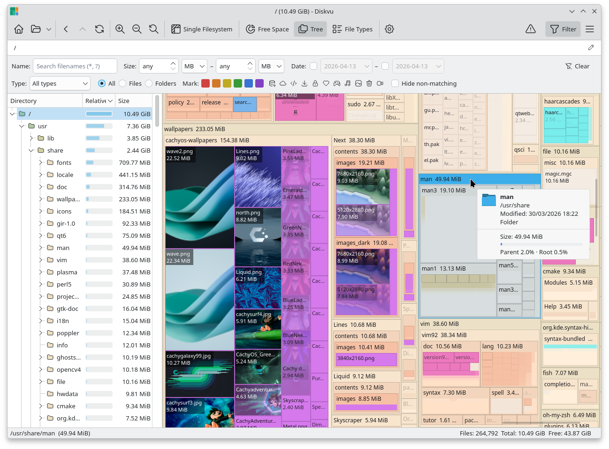

# Diskvu

Diskvu is a Qt-based Linux desktop application for exploring disk usage as an interactive treemap.



## Features

- Interactive treemap navigation with free zoom, breadcrumb and tree navigation
- Background refresh and filesystem watching for the active tree
- Search and filter by name, size, date and custom folder marks
- Optional image and video thumbnail generation
- File-type list with aggregate size and item counts
- Customisable themes, file colors, and automatic dark mode switching

## Requirements

- CMake 3.21 or newer
- A C++17 compiler
- Qt 6 development packages with:
  - `Core`
  - `Gui`
  - `Widgets`
  - `Concurrent`
  - `Svg`
  - `LinguistTools`
  - `Test` (for the test suite only)

**Debian/Ubuntu:**
```bash
sudo apt install cmake g++ \
    qt6-base-dev qt6-svg-dev \
    qt6-tools-dev qt6-l10n-tools
```

**Arch Linux:**
```bash
sudo pacman -S cmake qt6-base qt6-svg qt6-tools
```

**Fedora:**
```bash
sudo dnf install cmake gcc-c++ \
    qt6-qtbase-devel qt6-qtsvg-devel \
    qt6-qttools-devel qt6-linguist
```

**macOS (Homebrew):**
```bash
brew install cmake qt6
```

## Build

Configure and build with CMake:

```bash
cmake -S . -B build -DCMAKE_BUILD_TYPE=Release
cmake --build build --target diskvu -j$(nproc)
```

On **macOS**, point CMake at your Qt6 installation first:

```bash
cmake -S . -B build -DCMAKE_BUILD_TYPE=Release \
  -DCMAKE_PREFIX_PATH=$(brew --prefix qt6)
cmake --build build --target diskvu -j$(sysctl -n hw.ncpu)
```

The main app target is produced as `diskvu`:

```bash
./build/diskvu
./build/Diskvu.app   # (macOS)
```

macOS and Windows builds are currently unsupported but fully functional.

## Install

Install system-wide after building:

```bash
sudo cmake --install build
```

Or install to a custom prefix:

```bash
cmake --install build --prefix ~/.local
```

Uninstall with:

```bash
sudo cmake --build build --target uninstall
```
